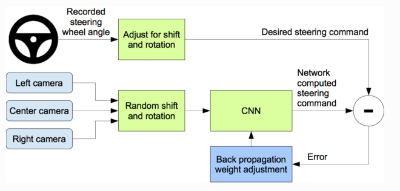
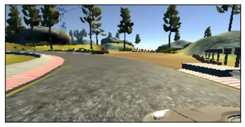
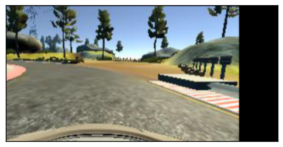

# imitation_learning
Based on work by [naokishibuya](https://github.com/naokishibuya/car-behavioral-cloning) and [markmaz](https://markmaz.com/neet/imitation_learning/)

## Introduction

This lab provides an introduction to **end-to-end imitation learning for vision-only navigation** of a racetrack. Let's break that down:

- We will train a deep learning model - specifically, a convolutional neural network (CNN) - to regress a steering angle directly from an image taken from the "front bumper" of a car.
- Here, "imitation learning" refers to a branch of supervised machine learning which focuses on imitating behavior from human-provided examples. In our case, we will drive a car around a track several times to provide examples for the CNN to mimic. This learning objective is also frequently termed behavioral cloning.
  - We will contrast this with our next lab on "reinforcement learning" where a robot agent learns to accomplish a goal via exploration, not via examples.
- "Vision-only" refers to using an RGB camera as the only input to the machine learning algorithm.
  - LIDAR, depth, or vehicle IMU data are not used.
- Here, "end-to-end learning" is shorthand for the CNN's ability to regress a steering angle (i.e., an actuation for the Ackermann steering controller) from unprocessed input data (pixels). We will not need to pre-process input features ourselves, such as extracting corners, walls, floors, or optical flow data. The CNN will learn which features are important, and perform all the steps from image processing to control estimation itself ("end-to-end", loosely speaking).

We will drive a simulated car around a virtual racetrack and collecting camera data from the rendered game engine, as well as our game inputs. We will define a CNN that will regress similar game inputs in order for the car to complete the same track autonomously. 

The network is based on [The NVIDIA model](https://devblogs.nvidia.com/parallelforall/deep-learning-self-driving-cars/), which has been proven to work in this problem domain.

|Lake Track|Jungle Track|
|:--------:|:------------:|
|[](https://youtu.be/hTPADovdyfA)|[](https://youtu.be/mZOc-zrbnR8)|
|[YouTube Link](https://youtu.be/hTPADovdyfA)|[YouTube Link](https://youtu.be/mZOc-zrbnR8)|


### Files included

- `train_pilotnet.ipynb` iPython Notebook used to create and train the model.
- `drive.py` The script to drive the car.
- `utils.py` The script to provide useful functionalities
- `model.h5` A pre-trained model weights.
- `environments.yml` conda environment (Use TensorFlow without GPU)

Note: drive.py is originally from [the Udacity Behavioral Cloning project GitHub](https://github.com/udacity/CarND-Behavioral-Cloning-P3) but it has been modified to control the throttle.


## Setup

### Install Anaconda
You will need [miniconda](https://docs.conda.io/en/latest/miniconda.html) or [anaconda](https://www.anaconda.com/products/individual) to install TensorFlow. Install the Python 3.8 version.

### Install Package and Dependencies
Once you have installed miniconda or anaconda, clone this repository locally:
```sh
$ git clone https://github.com/deweeseta/imitation_learning
$ cd imitation_learning/
```

Next install package dependencies using the conda command:
```sh
$ conda env create -f environment.yml
```

### Install Simulator
We will be using the udacity self-driving simulator for training and deployment.
Download the simulator for your platform [here](https://github.com/udacity/self-driving-car-sim)

Extract and run the simulator.
Note on linux these commands are:
```sh
$ unzip term1-simulator-linux.zip
$ chmod +x ./beta_simulator_linux/beta_simulator.x86_64
$ ./beta_simulator.x86_64
```


## Define Model

The model is defined using TensorFlow's [Keras API](https://tensorflow.org/) in the train_pilotnet.ipynb.  This model regresses steering angles from images using Pilotnet, hence the model will have onaly a single output.  See the implementation below:
```python
from tensorflow.keras.layers import Lambda, Conv2D, MaxPooling2D, Dropout, Dense, Flatten
from tensorflow.keras.models import Sequential

# you will need to crop or shrink images to the dimensions you choose here:
IMAGE_HEIGHT, IMAGE_WIDTH, IMAGE_CHANNELS = 66, 200, 3
INPUT_SHAPE = (IMAGE_HEIGHT, IMAGE_WIDTH, IMAGE_CHANNELS)

def build_model(dropout_rate=0.5):
    model = Sequential()
    model.add(Lambda(lambda x: x/127.5-1.0, input_shape=INPUT_SHAPE)) #normalizes image data
    model.add(Conv2D(24, (5,5), strides=(2, 2), activation='elu'))
    model.add(Conv2D(36, (5,5), strides=(2, 2), activation='elu'))
    model.add(Conv2D(48, (5,5), strides=(2, 2), activation='elu'))
    model.add(Conv2D(64, (3,3), activation='elu'))
    model.add(Conv2D(64, (3,3), activation='elu'))
    model.add(Dropout(dropout_rate)) 
    model.add(Flatten())
    model.add(Dense(100, activation='elu'))
    model.add(Dense(50, activation='elu'))
    model.add(Dense(10, activation='elu'))
    model.add(Dense(1))
    model.summary()
    return model
```

As configured above, the PilotNet CNN model expects a 200x66 crop of the inputted images and will output a steering angle between (-1, 1).

> **Exercises**
>
> How many trainable parameters are in this model? 
>
> What is the output volume of each layer?
>
> What is the effect of changing the input size on the total number of parameters in the model?
>
> **Hint 1** use `model.summary()` to print out a summary of the network.
>
> **Hint 2** Consider the input to the flattening operation and first dense layer: it is the output volume from the last convolutional layer. How is this affected by changing the input size? What about the next dense layer?
>
>
> Why do we normalize the input images between (-1,1) in the first layer? 
>
> **Hint** Consider the shape, domain, and range of common activation functions.
>
> With only a few changes to the above model and loss definitions, you can add a second output to estimate velocity.


## Train Model

We will use the three cameras mounted on the simulated car to collect training data. See exceprt from [Nvidia's blog post](https://devblogs.nvidia.com/deep-learning-self-driving-cars/) on why this is useful.

Here is a diagram from Nvidia that describes the training and *data augmentation* process for PilotNet


We will train our models in Jupyter Notebook:

```sh
$ conda activate imitation_learning
$ cd imitation_learning
$ jupyter notebook
```
Then open train_pilotnet.ipynb in your browser.

### Collect Training Data
First, create a new folder to store training data from the simulator.
Start simulator.
Now launch **Training** mode, click the record button, and configure the simulator to save data to the folder you created.

Once you have configured a folder to record your training data into, press **record** again and start to drive the car around.

The simulator will save three camera views from the car (left, center, and right) as jpegs, along with a csv file named *driving_log.csv* containing the image filenames, steering angles, and speed.

In the *IMG* folder you will the .jpg files with the following naming scheme corresponding to the above csv:

|Left|Center|Right|
|:--------:|:--------:|:--------:|
||||

### Image Augmentation
We apply a number of augmentation techniques to generate more images. This includes:
- Randomly choosing left, center, or right images
  - For left image, steering angle is adjusted by +0.2 and for right it is adjusted by -0.2
- Randomly flip image left/right
- Randomly translate image horizontally
  - adjust steering angle by 0.002 per pixel shift
- Randomly translate image vertically
- Randomly add shadows
- Randomly alter image brightness

Example of transformations include:
|Original|Flipped|Translated|
|:--------:|:--------:|:--------:|
|||

### Train/Validation Split
The collected data is partitioned into training and validation sets. The validation set helps ensure the model is not overfitting on the training data. In the notebook this is done by:
```python
from sklearn.model_selection import train_test_split
X_train, X_valid, y_train, y_valid = train_test_split(imgs, angles_rad, test_size=TEST_SIZE_FRACTION, random_state=SEED)
```
### Optimization
The model is optimized using the [Adam optimizer](https://www.tensorflow.org/api_docs/python/tf/train/AdamOptimizer), which will minimize the mean square error between the ground-truth steering angles and the currently predicted steering angles:

```python
model = build_model()
model.compile(loss='mean_squared_error', optimizer=Adam(lr=learning_rate))
```

## Run Inference
Start the simulator in **Autonomous Mode**. Then run the drive.py with the model saved from the checkpoint.
```sh
$ python drive_udacity.py $MODEL_NAME
```

## References
- NVIDIA model: https://devblogs.nvidia.com/parallelforall/deep-learning-self-driving-cars/
- Udacity Self-Driving Car Simulator: https://github.com/udacity/self-driving-car-sim/
- Naokishibuya car-behavioral-cloning: https://github.com/naokishibuya/car-behavioral-cloning/
- Markmaz imitation_learning: https://markmaz.com/neet/imitation_learning/
